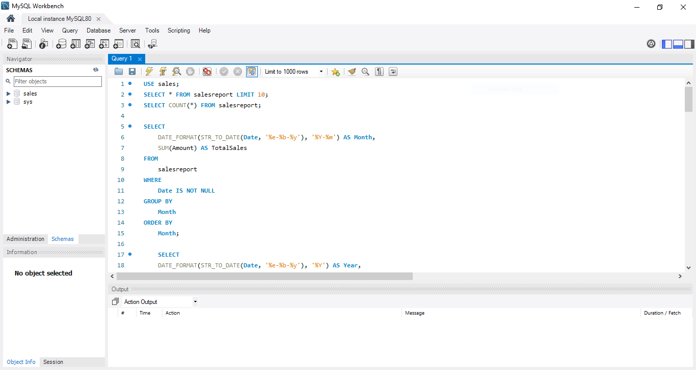

# Sales-Insights-SQL-and-PowerBI
This project analyzes Amazon sales data to provide insights into sales performance, product popularity, fulfillment efficiency, customer segmentation, and geographical sales distribution. The analysis leverages Power BI for data visualization and SQL for data processing to uncover trends, patterns, and actionable business insights.

# Table of Contents:
1. Problem Statement
2. Project Description
3. Key Objectives
4. Data Cleaning
5. Data Analysis using MySQL
6. Data Analysis (DAX)
7. Dashboard Creation
8. Tools And Technologies

# Problem Statement:
Analyze and Provide Insights on Amazon Sales Report.

# Project Description:
The provided dataset contains information about sales transactions on Amazon, including details such as order
ID, date, status, fulfilment method, sales channel, product category, size, quantity, amount, shipping details,
and more. The objecƟve is to conduct a comprehensive analysis of the data and extract actionable insights to
support business decision-making.

# Key Objectives:
1. Sales Overview: Understand the overall sales performance, trends, and paƩerns over time.
2. Product Analysis: Analyze the distribution of product categories, sizes, and quanƟƟes sold to identify popular
products.
3. Fulfillment Analysis: Investigate the fulfillment methods used and their effectiveness in delivering orders.
4. Customer Segmentation: Segment customers based on their buying behaviour, location, and other relevant
factors.
5. Geographical Analysis: Explore the geographical distribution of sales, focusing on states and cities.
6. Business Insights: Provide actionable insights and recommendations based on the analysis to optimize sales
strategies, improve customer satisfaction, and enhance overall business performance.

# Data Cleaning:
In this process, we cleaned the data. Key steps included:
1. Handling Null Values: Retained nulls in Amount and Currency for canceled orders and filled others as needed.
2. Data Type Conversion: Converted Date to date format and ensured Qty and Amount were numeric.
3. Duplicate Removal: Verified Order ID uniqueness and removed any duplicates.
4. Adding Calculated Columns: Created columns New and PendingS, e.g., “New in Region,” to analyze first-time regional orders and pending orders.
5. Currency Check: Confirmed all orders were in INR and left nulls for cancelled orders.

# Data Analysis using MySQL:

1. Monthly Sales Summary  
`SELECT DATE_FORMAT(STR_TO_DATE(Date, '%e-%b-%y'), '%Y-%m') AS Month, SUM(Amount) AS TotalSales`  
`FROM salesreport WHERE Date IS NOT NULL`  
`GROUP BY Month ORDER BY Month;`
          
2. Top Product Categories  
`SELECT Category, COUNT(*) AS SalesCount, SUM(Amount) AS TotalRevenue`  
`FROM salesreport`  
`GROUP BY Category ORDER BY TotalRevenue DESC LIMIT 5;`

3. Popular Product Sizes  
`SELECT Size, COUNT(*) AS QuantitySold`  
`FROM salesreport`  
`GROUP BY Size ORDER BY QuantitySold DESC;`

4. Total Quantity of Products  
`SELECT Category, SUM(Qty) AS TotalQuantity`  
`FROM salesreport WHERE Qty IS NOT NULL`  
`GROUP BY Category ORDER BY TotalQuantity DESC;`

5. Fulfilment Method Performance  
`SELECT Fulfilment, COUNT(*) AS TotalOrders, AVG(Amount) AS AvgOrderValue`  
`FROM salesreport`  
`GROUP BY Fulfilment ORDER BY TotalOrders DESC;`

6. Segment by Location and Total Spend  
`SELECT ship-state AS Location, COUNT(DISTINCT Order ID) AS NumberOfOrders, SUM(Amount) AS TotalSpent`  
`FROM salesreport WHERE Amount IS NOT NULL`  
`GROUP BY ship-state ORDER BY TotalSpent DESC;`

7. Segment by buying behaviour  
`SELECT CONCAT(ship-city, ', ', ship-state) AS Location, COUNT(Order ID) AS NumberOfOrders, SUM(Amount) AS TotalSpent,`  
    `CASE`  
        `WHEN SUM(Amount) > 100000 THEN 'High Value'`  
        `WHEN SUM(Amount) BETWEEN 10000 AND 100000 THEN 'Medium Value'`  
        `ELSE 'Low Value'`  
    `END AS CustomerSegment`  
`FROM salesreport WHERE Amount IS NOT NULL`  
`GROUP BY Location ORDER BY TotalSpent DESC;`

8. Geographical Analysis of Sales  
`SELECT ship-state AS State, ship-city AS City,COUNT(Order ID) AS NumberOfOrders, SUM(Amount) AS TotalSales`                
`FROM salesreport WHERE Amount IS NOT NULL`               
`GROUP BY ship-state, ship-city ORDER BY ship-state, TotalSales DESC;`

# Data Analysis (DAX):
Measures used in visualizations are:  
Key Measures:  
- TotalOrders = `COUNT('Amazon Sale Report'[Order ID])`
- TotalRevenue = `'Amazon Sale Report'[Qty] * 'Amazon Sale Report'[Amount]`
- TotalSales = `SUM('Amazon Sale Report'[TotalRevenue])`
- AvgOrderValue = `DIVIDE(SUM('Amazon Sale Report'[Amount]), COUNT('Amazon Sale Report'[Order ID]))`
- AvgSalesPerOrder = `AVERAGE('Amazon Sale Report'[TotalRevenue])`
- TotalQuantitySold = `SUM('Amazon Sale Report'[Qty])`
- PendingOrders = `COUNTROWS(FILTER('Amazon Sale Report', 'Amazon Sale Report'[PendingS] = "Yes"))`
- TotalRevenueFulfillment = `SUM('Amazon Sale Report'[Amount])`

# Dashboard Creation:

Data visualization for the data analysis (DAX) was done in Microsoft PowerBI Desktop:

# Tools And Technologies:
1. Microsoft Power BI
2. MySQL
3. Power Query Editor

